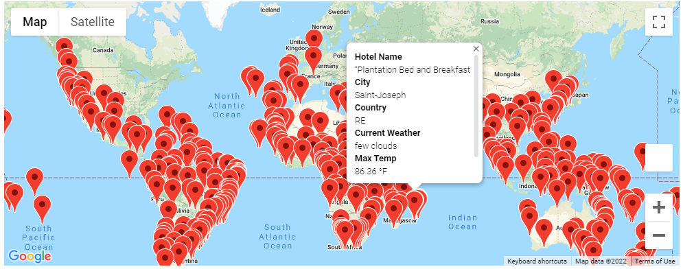
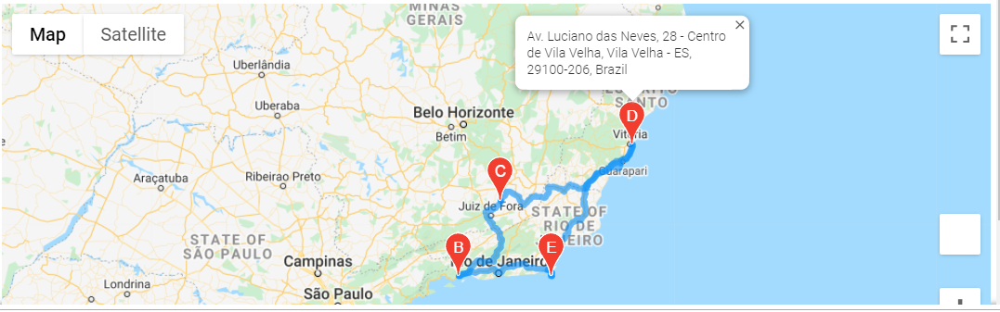
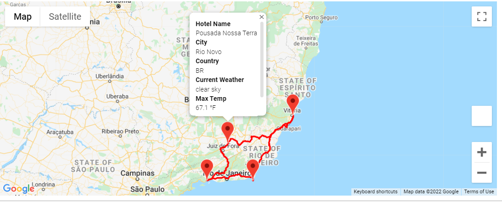

# World_Weather_Analysis
## Deliverable 1
- [Weather_Database](Weather_Database.ipynb)

## Deliverable 2
- [Vacation_Search](Vacation_Search.ipynb)
- [WeatherPy_database csv file](Weather_Database/WeatherPy_database.csv)
- 

## Deliverable 3
- [Vacation_Itinerary](Vacation_Itinerary.ipynb)
- [WeatherPy_vacation csv file](Vacation_Search/WeatherPy_vacation.csv)
- 
- 
